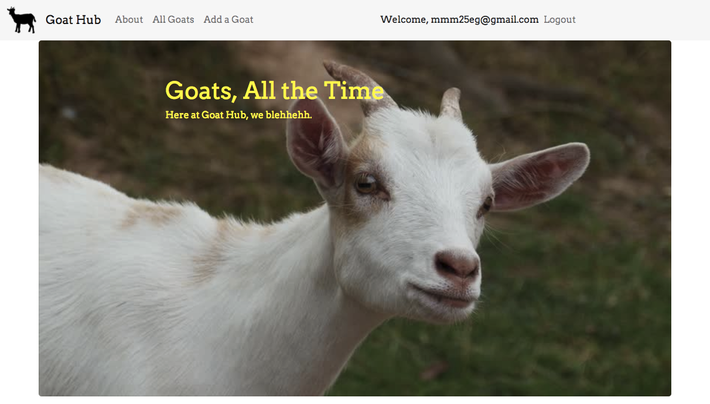

# Goathub: A Toy App for Learning Class-Based Views

If you're here, you probably watched my talk at PyBay 2017 on Class-Based Views, or you like goats,
or you like Django's Class-Based Views. Either way, welcome!

## Getting Started

- Install [Postgres](<https://postgresapp.com/) or the database of your choice. Edit the database config
  in settings.py as necessary.

- Create a database called goats.

- Make a virtual environment.

- Install `requirements.txt`.

- Make a superuser with `python manage.py createsuperuser`.

- Migrate your database `python manage.py migrate`.

## Run the app

- `python manage.py runserver`

- Add some goats by logging in with your superuser account and clicking "Add a goat" in the navbar.

  - That's right, you get to look for cute goat images!

## Questions? Problems?

Email meggie@hackbrightacademy.com.

